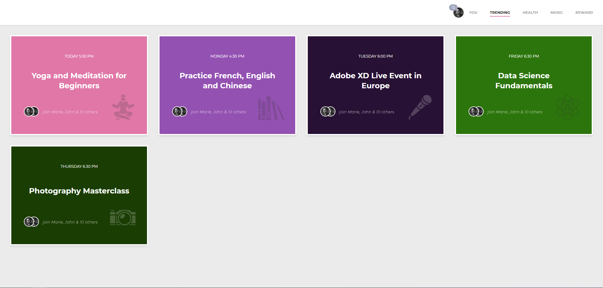

# 📦 Test d'intégration

Intégration d'une maquette en mobile first.

<br />


## Dependencies
- React & react-dom
- eslint
- prettier
- typescript
- vite
- TailwindCSS
- react-icons

<br />

## Setup

Install dependencies

```bash
  cd /integration-syloe
  yarn
```

Launch project

```bash
  yarn dev
```

<br />

## Rendu
Mobile


Desktop



